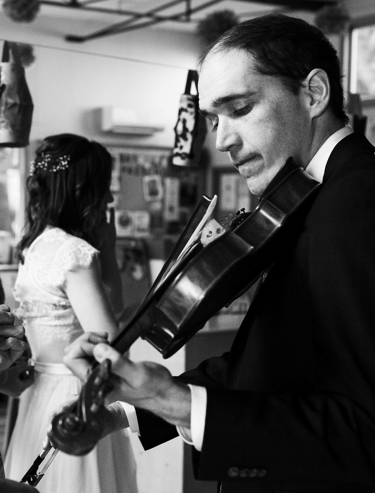
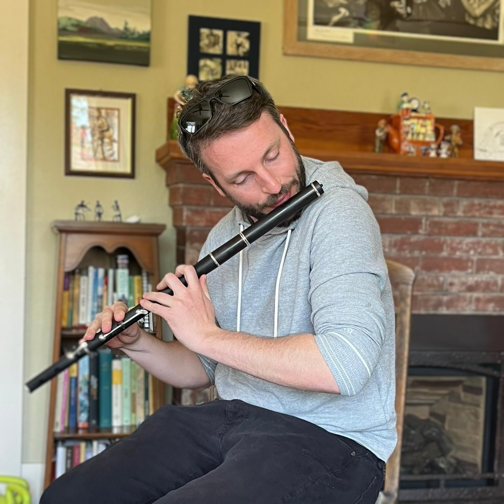
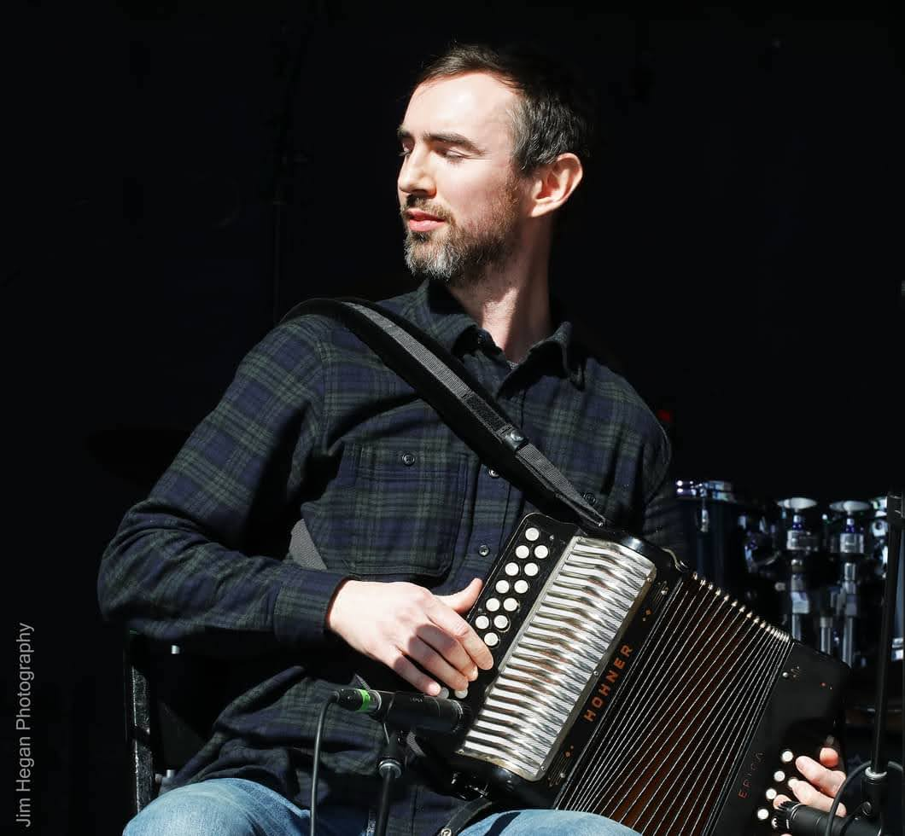

## Dave Clark

## Eoin Caulfield

Eoin is a concertina and flute player from Dublin, Ireland who has been living in Vancouver for the past 5 years. Eoin has been playing Irish traditional music since as early as he could talk, and has had the pleasure of being taught over the years by some of Ireland's greatest proponents of the music: the O'Connor family, Micheal O'Raghallaigh, Noel Hill, Harry Bradley, and Paul McGrattan. Eoin has countless regional and All-Ireland Fleadh medals to his name, and was a full-time gigging musician and music teacher in Dublin for many years, before moving to Vancouver and returning to his accountancy career.

## Conor Fleming

Conor is a button accordion player from Co. Clare, Ireland. He was introduced to traditional music as a child by Mary Liddy at local Comhaltas branch in Newmarket-on-Fergus, and was taught the B/C system of box playing by Conor MacCarthy and subsequently Colin Nea. As a teenager Conor was also a member of Denis Liddy's highly successful youth music group, the Barefied Céilí Band. Conor has performed at concerts and festivals in Ireland and internationally and has given accordion lessons to child and adult learners. 
