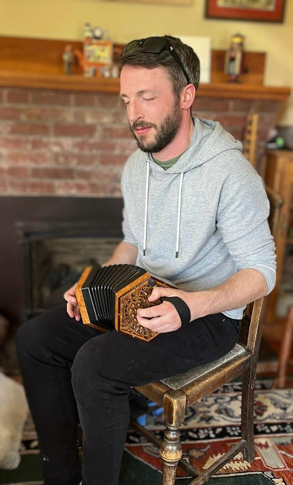

## Dave Clark

## Eoin Caulfield

Eoin is a concertina and flute player from Dublin, Ireland who has been living in Vancouver for the past five years. 
He has been playing Irish traditional music since as early as he could talk, and has had the pleasure of learning from some of Ireland’s greatest proponents of the music, including Aoife O’Connor, Micheál O’Raghallaigh, Noel Hill, Harry Bradley and Paul McGrattan. 
Eoin has won regional and All-Ireland Fleadh medals both solo and in céilí bands, and was a full-time gigging musician and music teacher in Dublin for several years, before moving to Vancouver and returning to his accountancy career.

## Conor Fleming

Conor is a button accordion player from Co. Clare, Ireland.
He was introduced to traditional music as a child by Mary Liddy at the local Comhaltas branch in Newmarket-on-Fergus, and learned the B/C system of box playing from Conor MacCarthy and subsequently Colin Nea. 
As a teenager, Conor was also a member of Denis Liddy's highly successful youth music group, the Barefied Céilí Band. 
Conor has performed at concerts and festivals in Ireland and internationally and has taught child and adult learners. 
